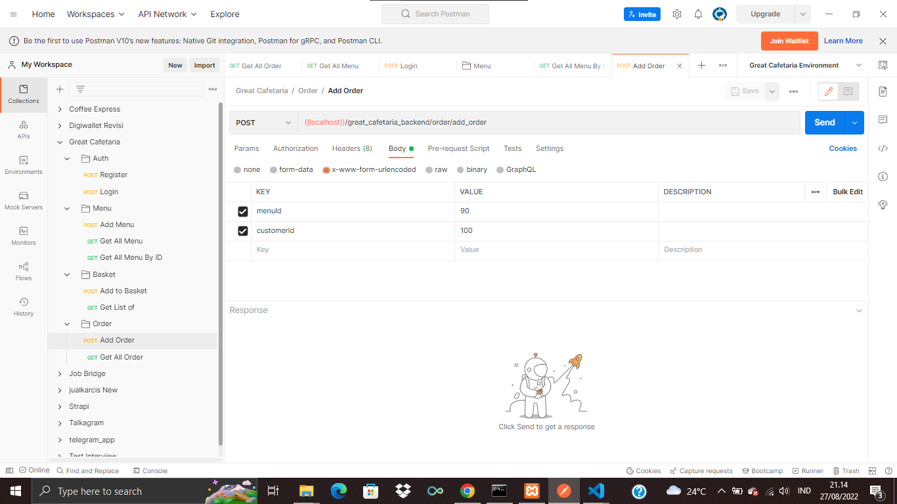

<h1 align='center'>Great Cafetaria API</h1> 

This is the API for Great Cafetaria, an application that people can use to order foods and beverages on Great Cafetaria for dinner 

## How to use 
Login before using the app. Or create an account of you don't have one. 

After logging in, you can find the list of available foods and/or beverages. Find what food or beverage that you want, and then click 'Order'. Now you only need to wait until the food is ready!

## How to use on Postman 
In this project, all routes start with '/great_cafetaria_backend'. There are four routes available: 

<ul>
  <li>'/auth', for authorization purpose (registration and logging in)</li>
  <ul>
    <li>'/register', for registraion</li>
    <li>'/login', to logging in, or more precisely, to receive JWT</li>
  </ul>
  
  <li>'/menu', list of available items</li>
  <ul>
    <li>'/add_menu', for adding new item on the menu. UNFINISHED</li>
    <li>'/get_all_menu', display all available items</li> 
    <li>'/get_menu/:id', display menu based on the ID</li>
  </ul>
  
  <li>'/order', all orders made by users/customers</li>
  <ul>
    <li>'/add_order', to order a fodd/beverage</li>
    <li>'/get_all_order', to dsplay all available orders</li>
  </ul>
</ul>

To hit all of those APIs (with the exception of '/auth', obviously), hit the login route ('auth/login'). Copy the JWT and use them to pass the authentication on all requests. 

### Make orders 
To make orders, enter the ID the user/account you are using along with the ID of the menu you are about to order. Send both data to the route '/add_order'. 

